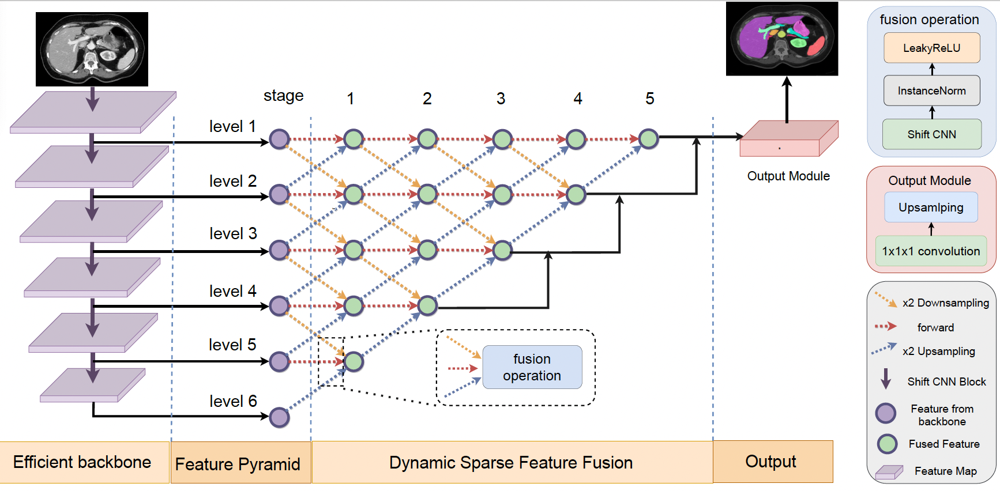

# E2ENet: Dynamic Sparse Feature Fusion for Accurate and Efficient 3D Medical Image Segmentation



E2ENet: Dynamic Sparse Feature Fusion for Accurate and Efficient 3D Medical Image
Segmentation. Boqian Wu, Qiao Xiao, Shiwei Liu, Lu Yin, Mykola Pechenizkiy, Decebal Constantin Mocanu, Maurice Van
Keulen, Elena Mocanu

Deep neural networks have evolved as the leading approach in 3D medical image 
segmentation due to their outstanding performance. However, the ever-increasing 
model size and computation cost of deep neural networks have become the primary 
barrier to deploying them on real-world resource-limited hardware. In pursuit of 
improving performance and efficiency, we propose a 3D medical image segmentation model, 
named Efficient to Efficient Network (E2ENet), incorporating two parametrically and 
computationally efficient designs. i. Dynamic sparse feature fusion (DSFF) mechanism: 
it adaptively learns to fuse informative multi-scale features while reducing redundancy. 
ii. Restricted depth-shift in 3D convolution: it leverages the 3D spatial information while 
keeping the model and computational complexity as 2D-based methods. We conduct extensive 
experiments on BTCV, AMOS-CT and Brain Tumor Segmentation Challenge, demonstrating that E2ENet 
consistently achieves a superior trade-off between accuracy and efficiency than prior arts across 
various resource constraints. In particular, with a single model and single scale, 
E2ENet achieves comparable accuracy on the large-scale challenge AMOS-CT, while saving 
over 68% parameter count and 29% FLOPs in the inference phase, compared with the 
previous best-performing method. 

[Link to paper](https://arxiv.org/abs/2312.04727) 🍺


# Requirements
For a full list of software packages and version numbers, see the file ```requirement.txt```.

# Usage

### STEP 1: Experiment planning and preprocessing

 Put your raw dataset in the correct folder (nnUNet_raw_data_base/nnUNet_raw_data/TaskXXX_MYTASK
```bash
python -u e2enet/experiment_planning/nnUNet_plan_and_preprocess.py -t xxx 
```
XXX is the integer identifier associated with your Task name TaskXXX_MYTASK.

### STEP 2: Model training

We trains E2ENet in a 5-fold cross-validation, as nnUNet. 
```bash
python -u simple_main.py --task XXX --network 3d_fullres --Tconv shiftConvPP --fold $fold --max_num_epochs 1000 
--num_batches_per_epoch 250 --sparse True --sparse_init uniform --growth random --density $density
--fix False --update_frequency 1200 --death-rate 0.5 
```

$fold specifies which fold of the 5-fold-cross-validaton is trained. $density is the density of E2ENet (e.g., 0.2)

**Notice**: please assign the path for 'network_training_output_dir_base' in paths.py before training. 

### STEP 3: Segemtation results predicting

- Segemtation results predicting for specific fold
```bash
python -u simple_predict.py -f $fold -o $OUTPUT_FOLDER/fold_$fold -m 3d_fullres -t XXX --Tconv shiftConvPP
```

- Segmentation results predicted based on the ensembling of 5 folds
```bash
python -u simple_predict.py -o $OUTPUT_FOLDER -m 3d_fullres -t XXX --Tconv shiftConvPP
```
### STEP 4: Results evaluating on the provided metrics

```bash
python -u evaluator.py -ref nnUNet_raw_data_base/nnUNet_raw_data/TaskXXX/labelsVa -pred $OUTPUT_FOLDER
```

# Acknowledgements
Our code is based on the [nnUNetV1](https://github.com/MIC-DKFZ/nnUNet/tree/nnunetv1)  framework.
